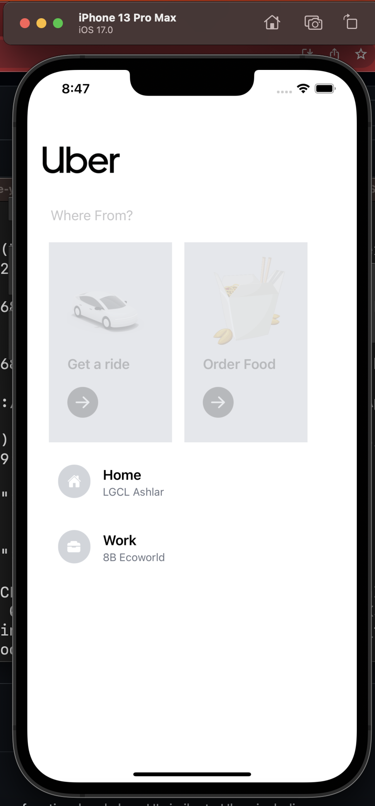

# Uber Clone App



## Overview

This project is an Uber Clone app built with React Native. The goal is to provide a functional and clean UI similar to Uber, including ride selection and real-time navigation. Thanks to [YouTube Tutorial](https://www.youtube.com/watch?v=bvn_HYpix6s&list=PLf16UKl7nR5AjcrYOe1niifJSAls3spDk) for inspiring me.

## Features

- Real-time navigation
- Selection of different types of rides (Uber Go, Uber XL, Uber X)
- Current location and destination selection
- Estimated travel time and distance
- Order Food (Feature in Progress)

## Technologies Used

- React Native
- Redux for state management
- React Navigation
- REST APIs
- React Native Elements (UI library)

## Installation

### Prerequisites

- Node.js
- NPM or Yarn
- React Native CLI
- Android Studio or Xcode (for running on a simulator)

### Clone the repository and install dependencies

```sh
git clone https://github.com/your-github-username/uberclone.git
cd uberclone
npm install
```

### To run the app

npx react-native run-ios
